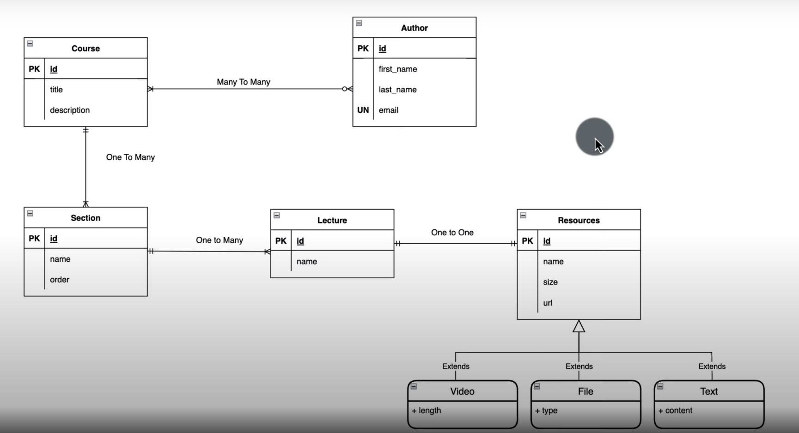

# Spring Boot JPA Application

## Overview

This project is a Spring Boot application that implements a database schema based on a class diagram for an educational platform. The application utilizes Spring Data JPA for ORM, Lombok for reducing boilerplate code, and MySQL as the database.


### Features

- **Entities**: Author, Course, Section, Lecture, Resource, and AuthorsCourses.
- **Relationships**: Many-to-One and One-to-One relationships between entities.
- **CRUD Operations**: Implemented for each entity through JPA repositories.

## Technologies Used

- **Spring Boot**: Framework for building Java applications.
- **Spring Data JPA**: For data access and ORM.
- **MySQL**: Relational database management system.
- **Lombok**: Java library to reduce boilerplate code (getters and setters).
- **Maven**: Dependency management and project build tool.

## Setup Instructions

### Prerequisites

- JDK 11 or higher
- Maven
- MySQL Server
- IDE (e.g., IntelliJ IDEA, Eclipse)

### Clone the Repository

```bash
https://github.com/Akshay-Gengaje/Spring-Data-JPA.git
```


### Database Setup

1. Create a MySQL database:
   ```sql
   CREATE DATABASE your_database_name;
   ```

2. Update the `src/main/resources/application.properties` file with your database connection details:

   ```properties
   spring.datasource.url=jdbc:mysql://localhost:3306/your_database_name
   spring.datasource.username=your_username
   spring.datasource.password=your_password
   spring.jpa.hibernate.ddl-auto=update
   spring.jpa.show-sql=true
   ```

### Build the Project

Run the following command in your terminal:

```bash
mvn clean install
```

### Run the Application

You can run the application using:

```bash
mvn spring-boot:run
```

## Usage

### Endpoints - {***IN PROGRESS***}

The application provides RESTful endpoints to perform CRUD operations. Here are some example endpoints:

- **Authors**
    - `GET /api/authors` - Retrieve all authors
    - `POST /api/authors` - Create a new author
    - `GET /api/authors/{id}` - Retrieve a specific author
    - `PUT /api/authors/{id}` - Update an existing author
    - `DELETE /api/authors/{id}` - Delete an author

- **Courses**
    - `GET /api/courses` - Retrieve all courses
    - `POST /api/courses` - Create a new course
    - `GET /api/courses/{id}` - Retrieve a specific course
    - `PUT /api/courses/{id}` - Update an existing course
    - `DELETE /api/courses/{id}` - Delete a course

- **Sections**
    - `GET /api/sections` - Retrieve all sections
    - `POST /api/sections` - Create a new section
    - `GET /api/sections/{id}` - Retrieve a specific section
    - `PUT /api/sections/{id}` - Update an existing section
    - `DELETE /api/sections/{id}` - Delete a section

- **Lectures**
    - `GET /api/lectures` - Retrieve all lectures
    - `POST /api/lectures` - Create a new lecture
    - `GET /api/lectures/{id}` - Retrieve a specific lecture
    - `PUT /api/lectures/{id}` - Update an existing lecture
    - `DELETE /api/lectures/{id}` - Delete a lecture

- **Resources**
    - `GET /api/resources` - Retrieve all resources
    - `POST /api/resources` - Create a new resource
    - `GET /api/resources/{id}` - Retrieve a specific resource
    - `PUT /api/resources/{id}` - Update an existing resource
    - `DELETE /api/resources/{id}` - Delete a resource

- **AuthorsCourses**
    - `GET /api/authors_courses` - Retrieve all authors-courses relationships
    - `POST /api/authors_courses` - Create a new relationship
    - `GET /api/authors_courses/{id}` - Retrieve a specific relationship
    - `PUT /api/authors_courses/{id}` - Update an existing relationship
    - `DELETE /api/authors_courses/{id}` - Delete a relationship

## Contributing

Contributions are welcome! Please create a pull request for any changes you would like to propose.

## License

This project is licensed under the MIT License - see the [LICENSE](LICENSE) file for details.

## Acknowledgements

- Spring Boot Team
- MySQL Team
- Lombok Team
```

### Customization

Make sure to replace placeholders like `yourusername`, `your-repo-name`, and `your_database_name` with the actual values relevant to your project. You can also expand the usage section with more detailed examples as needed.